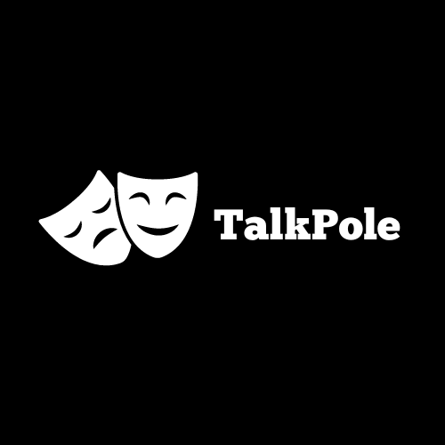
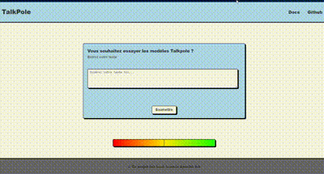

# TalkPole

<p align="center">

</p>

<p align="center" style="color:gray;">
  TalkPole Logo
</p>

## Overview

TalkPole is an innovative sentiment analysis model designed to accurately predict the sentiment of French sentences. Leveraging a range of neural network architectures, TalkPole excels in discerning both positive and negative sentiments with high precision. Trained on a comprehensive French dataset, TalkPole is finely tuned to understand and interpret the nuances of the French language.

As a forward-thinking solution, TalkPole seamlessly integrates into microservices architectures and offers flexible deployment through REST APIs, making it a versatile choice for modern applications.
<p align="center">

</p>

<p align="center" style="color:gray;">
  TalkPole UI Version
</p>

## Features

**Multiple Models**
* CNN
* LSTM
* CNN-BiLSTM
* DistilBERT

<p align="center">

</p>

<p align="center" style="color:gray;">
  Models Comparison
</p>

**REST API Version**

Exposes a REST API for interaction with the sentiment analysis service.

**Kafka Version**

Integrates with Kafka to process and analyze data in real-time. 

This version could be used in Microservices architecture.

**UI Version**

In Case, You wanted to experiment with different models and check documetations, you can use the UI Version

## Tools

This project wouldn't be possible without these tools:

<p align="center">


</p>

<p align="center" style="color:gray;">
  Tools Used
</p>

## Installation

### Prerequisites

* Python 3.x
* Tensorflow 2.17.0
* Keras 3.x
* Flask 3.x
* Kafka
* Docker

### Steps

**For Kafka Versions**

1. Clone Repository or use docker image in dockerhub

```bash
git clone https://github.com/Redtius/TalkPole.git -b Kafka-CNN-BiLSTM
```
OR
```bash
docker pull redtius/talkpole:kafka-cnn-bilstm
```

2. Set Up Kafka for the container
make sure you setup these **Required** Environment variables:

* `KAFKA_PORT` : set it to the port of the kafka server.
* `KAFKA_HOST` : set it to the host of the kafka server.

3. Run the Application

you can use docker compose to run the application

```bash
docker-compose up -d
```

OR

run the container depending on your own use

```bash
docker run -e KAFKA_PORT=9092 -e KAFKA_HOST=localhost -p 5000:5000 talkpole
```

### Usage

Request Body:
```json
{
 "ref":"reference-id",
 "content":"c'est le meilleur produit"
}
```
Response Body:
```json
{
 "ref":"reference-id",
 "content":"c'est le meilleur produit",
 "result":"0.97864554"
}
```

#### Kafka Integration

* **Producer**: Sends Messages to `talkpole_out` topic.
* **Consumer**: Listens to `talkpole_in` topic.

## Testing

To run Unit Tests for the project

```bash
pytest
```

## Troubleshooting

* **Common Issues**
   * Kafka connection problems: Ensure Kafka is running and accessible.
   * Model loading issues: Verify model files are present and correctly referenced.
   * Versions incompatibility: Make sure all dependencies have the right versions and python is 3.12+.

## License

This Project is under the Apache 2.0 License.


          


